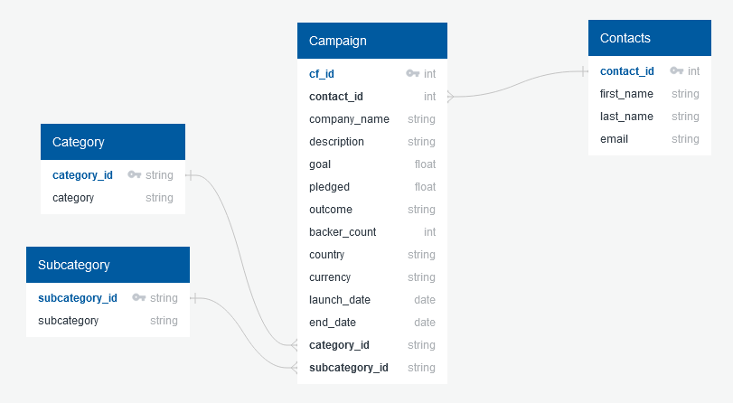

# Project 2: Crowdfunding ETL

## The Task
Build an ETL pipeline using Python, Pandas, and either Python dictionary methods or regular expressions to extract and transform the data. After transforming the data, create four CSV files and use the CSV file data to create an ERD and a table schema. Finally, upload the CSV file data into a Postgres database.

## User Story
```md
AS A data analyst for a crowdfunding service
I WANT to be able to consolidate and analyze data from multiple cources
SO THAT I can gain insight into business operations and make informed decisions.
```

## Acceptance Criteria
```md
A CATEGORY DATAFRAME IS CREATED
  * The DataFrame contains a "category_id" column that has entries going sequentially from "cat1" to "catn", where n is the number of unique categories
  * The DataFrame has a "category" column that contains only the category titles
  * The category DataFrame is exported as category.csv

A SUBCATEGORY DATAFRAME IS CREATED
  * The DataFrame contains a "subcategory_id" column that has entries going sequentially from "subcat1" to "subcatn", where n is the number of unique subcategories
  * The DataFrame contains a "subcategory" column that contains only the subcategory titles
  * The subcategory DataFrame is exported as subcategory.csv 

A CAMPAIGN DATAFRAME IS CREATED
  * The DataFrame has the following columns:
    * A "cf_id" column
    * A "contact_id" column
    * A "company_name" column
    * A "description" column
    * A "goal" column that is a float data type
    * A "pledged" column that is a float data type
    * An "outcome" column
    * A "backers_count" column
    * A "country" column
    * A "currency" column
    * A "launch_date" with the UTC times converted to the datetime format
    * An "end_date" with the UTC times converted to the datetime format
    * A "category_id" column that contains the unique identification numbers matching those in the "category_id" column of the category DataFrame
    * A "subcategory_id" column that contains the unique identification numbers matching those in the "subcategory_id" column of the subcategory DataFrame
  * The campaign DataFrame is exported as campaign.csv

A CONTACTS DATAFRAME IS CREATED
  * The DataFrame has the following columns:
    * A "contact_id" column
    * A "first_name" column
    * A "last_name" column
    * An "email" column


A CROWDFUNDING DATABASE IS CREATED
  * A database schema labeled, crowdfunding_db_schema.sql is created
  * A crowdfunding_db is created using the crowdfunding_db_schema.sql file
  * The database has the appropriate primary and foreign keys and relationships
  * Each CSV file is imported into the appropriate table without errors
  * The data from each table is displayed using a SELECT * statement
```

## Database Structure
An ERD of the tables of the database using the structure of the four CSV files in the Resources folder:



## License
This project is licensed under the GNU General Public License v3.0.  
License Link:
https://www.gnu.org/licenses/gpl-3.0.en.html   
[](https://www.gnu.org/licenses/gpl-3.0)
